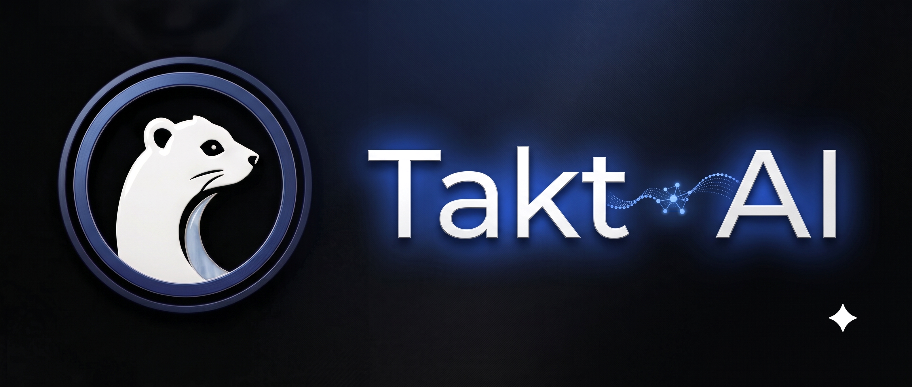

  

  
  
  
  

# Takt AI

Takt AI is a meta-harness for AI coding assistants.

It's not a standalone agent, an LLM, or a simple collection of prompt plugins. It operates a level deeper as an integration layer that sits between your local workspace and your AI tooling. It orchestrates the context, boundaries, and persistent state that raw coding assistants usually lack.

## Supported Agents

Takt AI currently integrates directly with:

- **Claude Code**
- **Codex**
- **OpenCode**
