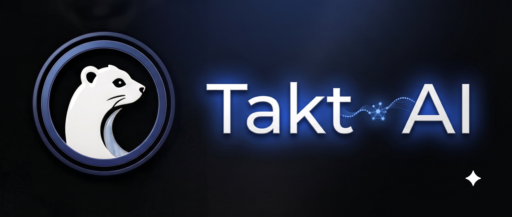

<div align="center">
  

  [](https://sonarcloud.io/summary/new_code?id=rou-cru_takt-ai)
  [](https://go.dev)
  [](https://www.gnu.org/licenses/agpl-3.0)
  [](https://github.com/rou-cru/takt-ai/releases)
</div>

# Takt AI

Takt AI is a meta-harness for AI coding assistants.

It's not a standalone agent, an LLM, or a simple collection of prompt plugins. It operates a level deeper as an integration layer that sits between your local workspace and your AI tooling. It orchestrates the context, boundaries, and persistent state that raw coding assistants usually lack.

## Supported Agents

Takt AI integrates directly with one coding agent:

- **OpenCode**

## Install

```sh
# Script: Linux/macOS; verifies checksums, and the Sigstore signature when cosign is installed
curl -fsSL https://raw.githubusercontent.com/rou-cru/takt-ai/main/install.sh | bash

# Homebrew (trust the tap first — Homebrew 7+ won't load an unofficial cask otherwise)
brew trust --tap rou-cru/homebrew-takt-ai
brew trust --cask rou-cru/takt-ai/takt-ai
brew install --cask rou-cru/takt-ai/takt-ai

# Go
go install github.com/rou-cru/takt-ai/takt/cli@latest   # binary is named "cli"; install.sh --method go renames it
```

Linux `.deb`, `.rpm`, `.apk` and Arch packages are attached to every [release](https://github.com/rou-cru/takt-ai/releases), together with SBOMs and signatures.

### Workspace on Docker or Kubernetes

```sh
docker run --rm -p 4096:4096 -e OPENCODE_PASSWORD=change-me -v "$PWD:/workspace" roucru/takt-ai:latest

helm install demo oci://ghcr.io/rou-cru/charts/takt-ai --namespace takt-workspaces --create-namespace
```

See [`charts/takt-ai`](charts/takt-ai/README.md) and [`docs/releasing.md`](docs/releasing.md) for versioning and artifact verification.
