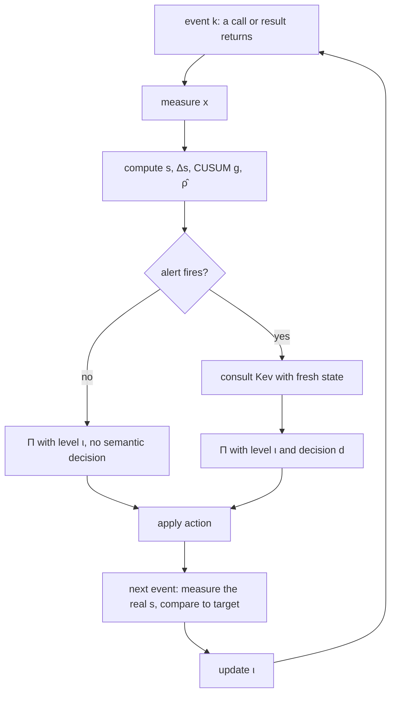
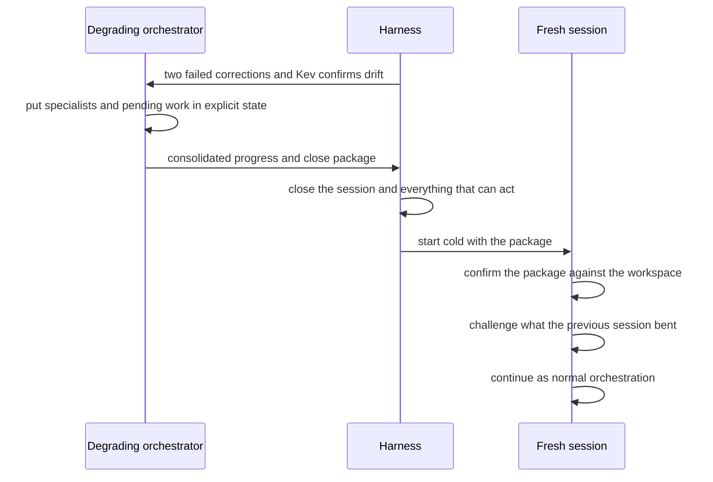

# Sliding mode control of the orchestrator with Kev

## The plant

Start with what we're controlling. It isn't the specialists. It isn't the tools. It's the orchestrator.

The orchestrator is the only agent in the crew that keeps accumulating context for the whole session, and it's the one whose mistakes get multiplied. A specialist that drifts wastes its own unit of work. An orchestrator that drifts delegates the wrong thing, briefs specialists with a muddled picture, and buys rework downstream. So that's the plant.

The bet is an external rail. Something outside the orchestrator that keeps it inside a useful operating range while it works, and that, when the drift is past recovery, spends whatever judgment is left on closing everything cleanly so a fresh session can pick it up.

Why external? Because the obvious alternative, asking the orchestrator to notice its own drift, has a poor track record. Without an outside signal, LLMs mostly fail to correct their own reasoning, and sometimes make it worse [Huang et al. 2023]. The thing that's degrading is the worst possible judge of its own degradation.

Why sliding mode and not something smarter? Because we don't have a model of the plant, and we're not going to get one. An LLM under accumulated context is a black box with a nonlinear, history-dependent, stochastic response. Sliding mode control was built for that posture: you don't predict the right action, you define a surface you want to stay on the good side of, and you push back whenever the trajectory crosses it. It's insensitive to the model uncertainty that would sink anything model-based. It contains the trajectory. It doesn't prescribe the decision. That's the property we want.

## The hypothesis

Occupied context is not broken context. Let's be careful about that from the start, because the naive version of this idea — "compact when the window is 75% full" — is wrong and nobody should build it.

The claim is weaker and more useful. Let $c[k] \in [0,1]$ be context occupancy at event $k$, and let $F[k]$ be the event that the orchestrator makes a bad call there: a hallucinated fact, a goal it quietly dropped, a small omission, or a failure that starts reinforcing itself into a loop. The hypothesis has two parts.

**Exposure.** The hazard grows with occupancy:

$$
p_F(c) = \Pr\big(F[k] \mid c[k] = c\big), \qquad p_F \text{ nondecreasing in } c.
$$

**Precursor.** Before the hazard shows up as a hard failure, it shows up as more oscillation that is still inside tolerance. One more minor error. One more harness rejection. One more repeated call. If $o[k]$ is any of those oscillation signals, then

$$
\operatorname{Var}\big(o \mid c\big) \text{ grows with } c \quad \text{while} \quad \mathbb{E}\big[o \mid c\big] \le o_{\mathrm{ref}}.
$$

The second part is the interesting one. It says there's lead time: the plant wobbles before it falls. That's what makes a controller possible at all, because you can push back during the wobble instead of cleaning up after the fall.

### What the literature already says

None of this is a wild guess. Three independent lines of evidence point the same way.

**Length degrades, and it degrades as unreliability.** Chroma tested 18 models, frontier ones included, on deliberately trivial tasks and found performance "grows increasingly unreliable as input length grows," non-uniformly and well before the window is full [Hong et al. 2025]. Position matters too: information in the middle of a long context is used worse than at the edges [Liu et al. 2023].

**Multi-turn degradation is mostly variance.** This is the closest thing to a direct test of the precursor. Across 15 LLMs and 200,000+ simulated conversations, multi-turn performance drops an average of 39% against single-turn. Decomposed, aptitude drops about 15% while unreliability, the gap between best and worst runs, goes up 112% [Laban et al. 2025]. The mean barely moves. The spread explodes. That's the shape the precursor predicts.

The same paper has a second finding we'll lean on later: once a model takes a wrong turn, it tends not to recover. That's an argument for closing early rather than repairing forever.

**Systems near a tipping point announce it.** Ecology and climate science have a name for the wobble before the fall: critical slowing down. As a system approaches a bifurcation, its dominant eigenvalue goes to zero, it recovers from small perturbations more and more slowly, and that leaves two fingerprints in the time series: rising variance and rising lag-1 autocorrelation [Scheffer et al. 2009]. That gives us a sharper precursor than variance alone. If $s$ is the surface defined below and we fit

$$
s[k+1] - \bar{s} = \hat{\rho}[k]\,\big(s[k] - \bar{s}\big) + w[k]
$$

over a recent window, then $\hat{\rho}[k] \to 1$ means the orchestrator is taking longer and longer to come back from each small disturbance. Slow recovery is the precursor.

There's an honest caveat from the same literature. These generic indicators say *that* a transition is coming, not *which* one; they lack specificity [Kéfi et al. 2013]. Keep that in mind. It's exactly the gap Kev fills.

| What we see | What it means | What it does not mean |
|---|---|---|
| $c$ high, oscillation flat | Lots of context, all of it still pulling its weight | Time to compact |
| $c$ moderate, oscillation rising | The precursor is showing up early | The orchestrator is broken |
| $\hat{\rho}$ climbing toward one | Recovery from small errors is slowing down | A specific cause is known |
| Oscillation crossing tolerance repeatedly | The plant is leaving the useful range | Every crossing needs a hard response |
| Hard failures with no prior oscillation | The precursor didn't precede the failure | Anything the controller can fix |

### How it could be wrong

The hypothesis is refutable, and these are the ways it fails:

- **No lead time.** Hard failures arrive without a measurable rise in variance or autocorrelation beforehand. Then there's nothing to react to, and the rail degenerates into a post-mortem.
- **Flat hazard.** Once you control for task phase, $p_F(c)$ doesn't move. Then occupancy is just a proxy for "the hard part of the task," and $c$ doesn't belong in the surface.
- **Corrections don't bite.** The surface crosses, the controller acts, and $s$ doesn't come back any faster than without the action. Then we have a sensor but no actuator.
- **The precursor is noise.** Rising variance shows up just as often in sessions that end fine. Then the indicator has no discriminating power and the alert threshold can't be set without drowning in false alarms.

## Counting in events

The runtime has no continuous time, and pretending it does causes real bugs. A human taking twenty minutes to answer, or a slow network call, is not degradation. Wall-clock time measures the wrong thing.

So we index by work. $k \in \mathbb{N}$ ticks every time something comes back: a tool call returns, a specialist reports a result. Every quantity below lives on that index. Control theory has a name for the part of this that decides *when* to act rather than sampling on a fixed period: event-triggered control [Tabuada 2007]. We sample on every event, and we consult the expensive sensor only when an event-triggered condition fires.

The state read at each event is

$$
x[k] =
\begin{bmatrix}
c[k] \\ r[k] \\ e[k] \\ b[k]
\end{bmatrix}
\in [0,1]^4 .
$$

| Signal | Name | What it measures | Role |
|---|---|---|---|
| $c[k]$ | Exposure | Fraction of the context window in use | Drives the hazard |
| $r[k]$ | Reiteration | Share of repeated calls in the recent event window | Oscillation |
| $e[k]$ | Schema violations | Malformed calls or outputs in the window | Oscillation |
| $b[k]$ | Rejections and errors | Harness denials and execution errors in the window | Oscillation |

$c$ is the exposure. $r$, $e$ and $b$ are the visible wobble. The windows are counted in events, never in seconds.

## The sliding surface

Each signal gets a reference: the point where it stops being slack and starts eating margin. A reasonable starting point is

$$
x_{\mathrm{ref}} = \begin{bmatrix} 0.75 & 0.10 & 0 & 0.05 \end{bmatrix}^{\top}.
$$

With positive weights $C = [c_1, c_2, c_3, c_4]^{\top}$, $c_i > 0$, the surface is

$$
s[k] = C^{\top}\big(x[k] - x_{\mathrm{ref}}\big) = \sum_{i=1}^{4} c_i \big(x_i[k] - x_{i,\mathrm{ref}}\big),
\qquad
\Delta s[k] = s[k] - s[k-1].
$$

$s[k] \le 0$ is the useful range. $s[k] > 0$ is outside it. One scalar, and it tells you how far past the edge you are.

A caveat worth saying out loud: the sum orients correction, it doesn't decide legality. A weighted sum can let a large margin on $c$ hide a violation on $e$. That's fine for steering. It would be terrible for gating. Hard invariants stay hard and are checked separately, by $\Pi$, further down.

$\Delta s$ is what separates heading toward the edge from coming back from it. The two together give four regions:

| | $\Delta s[k] \le 0$ | $\Delta s[k] > 0$ |
|---|---|---|
| $s[k] \le 0$ | Inside and receding. Leave it alone | Inside but approaching. Within $\phi$ of the edge the first rung kicks in; deeper inside, just watch |
| $s[k] > 0$ | Outside, coming back. Let the last correction work | Outside and getting worse. Escalate |

Note the asymmetry with textbook SMC. Classic SMC wants $s = 0$, sliding along the surface from both sides. We don't. We want $s \le 0$, and inside that region the orchestrator works without interference. The surface is a one-sided boundary, not a track to ride.

## Inside the range, it's a barrier

That one-sidedness has a precise name in modern control: a safe set. Define

$$
\mathcal{S} = \{\, x : -s(x) \ge 0 \,\}.
$$

The discrete-time control barrier function condition [Agrawal & Sreenath 2017] keeps a system inside a safe set $\{h \ge 0\}$ by requiring $h(x[k+1]) \ge (1-\alpha)\,h(x[k])$ for some $\alpha \in (0,1]$. With $h = -s$ that reads

$$
s[k+1] \le (1 - \alpha)\, s[k] \qquad \text{for } s[k] \le 0 .
$$

Read it slowly. Inside the range, $s$ is allowed to move toward the edge, but only by a shrinking fraction of the margin left. It can approach. It can't jump across. That's the precise meaning of "the orchestrator works freely inside, and we only push back when the wobble is about to take it out."

So the design has two regimes and one inequality family:

| Region | Condition we want | Classical name |
|---|---|---|
| $s \le 0$ | $s[k+1] \le (1-\alpha)\,s[k]$ | Discrete control barrier function |
| $s > 0$ | $s[k+1] \le (1-k_s)\,s[k] - \eta\,\operatorname{sat}_\phi(s[k])$ | Discrete reaching law |

The barrier keeps the good region invariant. The reaching law brings you back when you've left it.

## The reaching law

The textbook reaching law in continuous time is

$$
\dot{s} = -\eta \operatorname{sign}(s) - \lambda s, \qquad \eta > 0,\; \lambda \ge 0 :
$$

a constant push toward the surface plus a proportional term that makes the approach faster when you're far out. It guarantees $s\dot{s} < 0$ away from the surface, so the trajectory reaches it in finite time [Utkin 1977].

We don't have $\dot{s}$. We have events. The discrete form, due to Gao, Wang and Homaifa, is

$$
s^{\star}[k+1] = (1 - k_s)\, s[k] - \eta \operatorname{sign}\big(s[k]\big), \qquad 0 \le k_s < 1,\; \eta > 0 .
$$

Here's the part that's easy to get wrong. In a mechanical plant this equation is a design target you enforce by inverting a model. We have no model, so $s^{\star}[k+1]$ is not something we compute an input from. It's the response we want, and the real $s[k+1]$ gets measured at the next event. The gap

$$
\varepsilon[k+1] = s[k+1] - s^{\star}[k+1]
$$

says how far the real response fell short of the intended one. $\varepsilon \le 0$ means the correction bit at least as hard as intended; a persistent $\varepsilon > 0$ is what tells you $\eta$ and $k_s$ are asking for more than the interventions can deliver.

This is closer in spirit to model-free control than to classical SMC. Fliess and Join replace the plant model with an ultra-local model whose single unknown term is re-estimated from measurements at every step [Fliess & Join 2013]. $\varepsilon$ plays that role here: it's the online, measured residue of everything we don't model.

### What discretization costs

Discrete time kills the idea of an exact sliding mode. The trajectory can't sit on $s = 0$; at best it stays in a band $\lvert s[k] \rvert \le \delta$, the quasi-sliding regime. Sarpturk, Istefanopulos and Kaynak gave the classical conditions for moving toward the surface without growing oscillation around it:

$$
\big(s[k+1] - s[k]\big)\operatorname{sign}\big(s[k]\big) < 0,
\qquad
\big(s[k+1] + s[k]\big)\operatorname{sign}\big(s[k]\big) \ge 0 ,
$$

which together say $\lvert s[k+1] \rvert < \lvert s[k] \rvert$: each step moves toward the surface, and doesn't overshoot past it by more than it started.

Gao's law has a well-known property here: once the trajectory reaches the band, it crosses the surface at every single step and stays inside a band whose width is set by $\eta$ [Latosiński & Bartoszewicz 2024]. It's easy to see in our notation. For $0 < s[k] \le \eta$,

$$
s^{\star}[k+1] = (1-k_s)\,s[k] - \eta \in \big(-\eta,\ -k_s\eta\big],
$$

so the band $\lvert s \rvert \le \eta$ is invariant, and the steady oscillation is a two-cycle between $\pm\, \eta / (2 - k_s)$.

For a mechanical plant that zigzag is chatter. For us it's worse than chatter. Crossing to the inside and back every event would mean the controller intervenes, backs off, and intervenes again on every single call. Bartoszewicz's redefinition of quasi-sliding mode drops the requirement to cross at all: it's enough to stay in the band [Bartoszewicz 1998]. That's the definition we want.

### The boundary layer, with a constraint

The standard fix is the boundary layer [Slotine & Li 1991]. Replace $\operatorname{sign}$ with

$$
\operatorname{sat}_{\phi}(s) =
\begin{cases}
s/\phi, & \lvert s \rvert \le \phi \\
\operatorname{sign}(s), & \lvert s \rvert > \phi
\end{cases}
\qquad \phi > 0,
$$

so the target becomes

$$
s^{\star}[k+1] = (1 - k_s)\, s[k] - \eta \operatorname{sat}_{\phi}\big(s[k]\big).
$$

Inside the layer this is linear, $s^{\star}[k+1] = \gamma_\phi\, s[k]$ with

$$
\gamma_\phi = 1 - k_s - \frac{\eta}{\phi}.
$$

And that gives a concrete design rule rather than a vague "this reduces chatter." The approach is stable iff $\lvert \gamma_\phi \rvert < 1$, and it's monotone, never crossing the surface, iff $\gamma_\phi \ge 0$. So

$$
\phi \;\ge\; \frac{\eta}{1 - k_s}
$$

is the condition for a non-switching approach. Pick a thinner layer than that and you've reintroduced the zigzag by hand.

## Noise, and why crossings lie

Everything above treats $s$ as deterministic. It isn't. The same orchestrator in the same state can produce different calls, and the signals in $x$ are counts over small windows. Honestly modelled, the closed loop looks like

$$
s[k+1] = s^{\star}[k+1] + d[k] + w[k],
$$

with $d[k]$ the slow drift we actually care about and $w[k]$ zero-mean noise of variance $\sigma^2$.

Stochastic sliding mode theory, for Itô systems among others, gets reachability in probability or in mean square, not pointwise [Niu, Ho & Wang 2007]. You can't promise $s$ stays below zero. You can promise something about its distribution. Three consequences follow, and each one changes the design.

**The band can't be thinner than the noise.** Inside the boundary layer the loop is an AR(1) process, $s[k+1] = \gamma_\phi s[k] + w[k]$, whose stationary variance is

$$
\operatorname{Var}(s) = \frac{\sigma^2}{1 - \gamma_\phi^2}.
$$

A smaller $\gamma_\phi$ squeezes the band, at the price of more intrusion. And there's a free diagnostic hiding in there: if the measured variance of $s$ climbs well above $\sigma^2 / (1 - \gamma_\phi^2)$, something other than noise is moving the plant. That's the precursor again, showing up in a form we can test.

**Raw crossing counts are a bad alarm.** With noise, $s$ crosses zero by accident. Counting crossings either fires on noise or, with a high threshold, fires late. The textbook answer to "detect a small persistent shift in the mean of a noisy signal as fast as possible" is Page's CUSUM [Page 1954]:

$$
g[k] = \max\big(0,\ g[k-1] + s[k] - \kappa\big), \qquad \text{alarm when } g[k] \ge \bar{g},
$$

with $\kappa$ set between the in-range mean of $s$ and the smallest drift worth catching. CUSUM is minimax-optimal for this problem in Lorden's sense: for a given false-alarm rate, nothing detects a mean shift faster in the worst case [Lorden 1971].

**The constraint becomes a chance constraint.** "$s \le 0$" turns into

$$
\Pr\big(s[k] > 0\big) \le \beta ,
$$

the formulation stochastic MPC uses for exactly this reason [Mesbah 2016]. $\beta$ is a budget for how often we tolerate being outside, which is a more honest knob than pretending we can stay inside always.

## What the input actually is

The older drafts modeled $u[k]$ as a vector of continuous knobs: a compaction policy, a repeat limit, a schema tolerance, a rejection threshold. Push the knobs, the state moves. It's tidy, and it's wrong in two ways.

First, there are no continuous knobs here. What the rail can do is a short list of discrete interventions. Second, and worse, "tighten the schema tolerance" to bring $e$ down means manufacturing more rejections, which raises $b$, which is exactly the oscillation we're trying to calm. $e$ and $b$ are observed. They're never fixed by squeezing tolerances.

So the input is an intrusion level $\iota[k]$ over an ordered ladder:

| $\iota$ | Intervention | What it changes |
|---|---|---|
| $0$ | Continue | Nothing. The orchestrator works |
| $1$ | Cut unproductive repetition | Stops a reiteration that isn't producing anything new |
| $2$ | Repair | Fixes the format or redoes the last step that went wrong |
| $3$ | Checkpoint | Freezes progress before touching state that won't rebuild itself |

Correcting means changing conditions so $s$ drops at the next event. If it doesn't, you raise intrusion instead of repeating the same move. Written as an update rule:

$$
\iota[k+1] =
\begin{cases}
0, & s[k+1] \le -\phi \\
\min\big(\iota[k] + 1,\ \iota_{\max}\big), & s[k+1] > -\phi \;\wedge\; \Delta s[k+1] \ge 0 \\
\iota[k], & \text{otherwise}
\end{cases}
$$

Well inside the range, intrusion resets. Near or past the edge, an event where $s$ didn't drop escalates one rung. An event where it did drop holds the current rung while the trajectory comes back.

The closest classical cousin of this is fuzzy sliding mode control, where linguistic rules indexed by $s$ replace the linear ramp inside the boundary layer [Palm 1994]. The ladder is the same move with a discrete, auditable rule set instead of membership functions.

Two things are missing from the ladder on purpose. Compaction isn't a rung; it's a scheduled action with its own safety condition. And closing the session isn't a rung either; it's what happens when the ladder stops working. Both get their own sections.

## Kev as the semantic sensor

The counters have a blind spot, and the critical-transitions literature told us so: generic indicators say something is coming, not what. Three identical calls in a row could be a loop, or it could be the orchestrator legitimately polling something that hasn't finished. A high $c$ could be dead weight, or it could be context the next decision really needs. $s$ can't tell the difference. Something has to read the situation.

That something is Kev [Palmer 2026]: a family of small decision models built on Qwen3.5 and Qwen3.8 bases, with a rank-16 LoRA adapter and a pointer head trained to return decisions as probability distributions instead of text. It speaks the System One API through `POST /v1/systemone` and answers three kinds of closed question in a single request:

| Kev type | Returns | What we ask with it |
|---|---|---|
| `choice` | The most likely option, its distribution, a confidence | What is the dominant cause of the current oscillation? |
| `noul` | Probability of yes | Does this specific candidate action apply here? |
| `score` | Mean level over an ordered scale, with distribution | How severe is the drift? |

Why Kev and not Jev, the closed hosted model it reimplements? Because Kev can be pinned to an exact checkpoint, run locally, fine-tuned on our own labels, and validated against our own integration, and its probabilities ship calibrated with a fitted temperature per checkpoint. Jev is somebody else's moving target.

Kev isn't perfect, and the design doesn't need it to be. Its published caveats point in a clear direction: calibration can drift on unfamiliar distributions, and the smaller checkpoints are validated only up to about 8k tokens of state. Both argue for the same thing. Short, structured inputs, and a bounded set of things Kev's answer is allowed to cause.

What goes into each consultation is fresh state from this $k$ and nothing else:

| Included | Excluded |
|---|---|
| Goal and current phase | The orchestrator's full prompt |
| What changed since the previous attempt | Session history |
| $s[k]$, $\Delta s[k]$, $\hat{\rho}[k]$ | Kev's own previous answers |
| The legal candidate actions, as proposed by the harness | Recommendations Kev can't see |
| Invariants $\mathcal{I}[k]$ | |

Kev's questions within one request are isolated from each other: they share the state but can't read each other's answers. That's a feature, but it forces a discipline. Every question has to stand on its own. You can't ask "which cause dominates" and then "is the fix for that cause legal" in the same packet, because the second question never sees the first answer. Never validate a recommendation the validator can't see.

### Turning probabilities into guarantees

A calibrated probability is necessary, not sufficient. What we actually need is a statement like "the rail closes a healthy session at most $\alpha$ of the time." That's a risk-control problem, and there are distribution-free tools for it.

Learn then Test picks a decision threshold $\tau$ from labelled data such that

$$
\Pr\Big(\mathrm{Risk}(\tau) \le \alpha\Big) \ge 1 - \delta ,
$$

with no assumption about the model beyond exchangeability of the calibration set [Angelopoulos et al. 2021]. Conformal risk control gives the same kind of guarantee in expectation [Angelopoulos et al. 2022]. KnowNo already did this for LLM planners: conformal prediction decides when the planner is uncertain enough to stop and ask for help, with a statistical guarantee on task success [Ren et al. 2023]. Our "does the evidence confirm drift" question is the same shape. Kev's own benchmark reports exactly this operating point, the share of decisions automatable at a fixed error budget, so the measurement already exists for its released suites; we'd repeat it on our own labelled traces.

## The projection

The harness has the final say. Kev produces a semantic decision $d[k]$; the harness projects everything onto what's actually allowed:

$$
u[k] = \Pi\big(\iota[k],\, d[k],\, \mathcal{I}[k],\, v[k]\big),
$$

where $v[k]$ is the version of the state the decision was made against. $\Pi$ is deterministic. Same inputs, same action.

In the safe-RL vocabulary, $\Pi$ is a shield: a runtime filter between the policy and the plant that blocks or replaces actions that violate a specification [Alshiekh et al. 2018]. In control vocabulary it's a safety filter. Either way the point is the same. Whatever the learned component proposes passes through something that can be audited.

| Situation | What $\Pi$ does |
|---|---|
| $d[k]$ arrived, matches $v[k]$, respects $\mathcal{I}[k]$ | Picks the action at level $\iota[k]$ that $d[k]$ selects |
| $d[k]$ arrived late, or $v[k]$ is no longer the current state | Records it. Moves nothing |
| $d[k]$ never arrived | Applies the deterministic restoration for that level |
| $d[k]$ picks something outside $\mathcal{I}[k]$ | Ignores the pick, applies the restoration |

The consequence is the reason the whole design is safe to run with an imperfect model. Kev's imprecision can land on continue, repair or checkpoint. It can never land on a session close triggered by a lone score.

Kev isn't consulted every event either. Only when there's something to interpret. That's decided by an event-triggered alert

$$
a[k] = f\big(s[k],\, \Delta s[k],\, N_{\mathrm{cross}}[k],\, N_{s>0}[k]\big),
$$

where $N_{\mathrm{cross}}[k]$ counts crossings of the edge and $N_{s>0}[k]$ counts events spent outside the range, both over recent work, no clock involved. Given the noise section, the natural concrete $f$ is the CUSUM alarm $g[k] \ge \bar{g}$ backed by the slowing-down indicator $\hat{\rho}[k] \ge \bar{\rho}$, with the raw counters kept as the inputs they summarise rather than as triggers on their own.

## Pit stops

Compaction is the one action that actually lowers $c$, which makes it tempting to fire whenever $c$ gets big. Don't. Compacting at the wrong moment throws away exactly the context the next step needed, and the result is a spike in $r$ and $b$ as the orchestrator stumbles around rediscovering it.

Think of it as a pit stop. You take it on the lap where it makes sense, not the moment the tires feel worn. The safe point is between closing one unit of work and opening the next, with no open incident that depends on the immediate context. If the moment is bad, you wait for the next lap.

The purge is small. It drops what already served its purpose and keeps:

- the goal,
- the invariants,
- the decisions still in force,
- a reference to where progress stands.

What to keep isn't guesswork either. ACON optimises compression guidelines by looking at which compressions made the agent fail, and gets 26 to 54% lower peak token usage while matching or improving task success [Kang et al. 2025]. The lesson transfers: the keep-list is something you refine from failures, not something you get right on day one.

Then you check whether it worked. At the next event after compaction you want

$$
c[k+1] < c[k] \quad \text{and} \quad r,\ b \text{ not oscillating more than before}.
$$

If $c$ dropped but $r$ and $b$ got noisier, the compaction cut something load-bearing.

## Closing while you still can

Sometimes the ladder doesn't work. The rule for giving up is

$$
N_{\mathrm{fail}}[k] \ge 2 \;\wedge\; d[k] \text{ confirms drift with evidence}
\;\Longrightarrow\; \text{close},
$$

where $N_{\mathrm{fail}}$ counts corrections that didn't bring $s$ down. Both conditions, never one. The counter alone could be bad luck; Kev alone could be a miscalibrated score.

Formally this is an optimal stopping problem. The drift started at some unknown event, and we want to stop as soon as possible after it without stopping before it. Shiryaev's answer is to stop when the posterior probability that the change has already happened crosses a threshold [Shiryaev 1963]. We don't have the likelihoods to compute that posterior exactly. The two-condition rule is a cheap stand-in: failed corrections are the evidence from the actuator, Kev's confirmation is the evidence from the sensor, and requiring both is the conservative way to fuse them.

The timing is the whole point. You close while the orchestrator can still coordinate, because a clean close takes judgment and that's the resource that's running out. Wait too long and the close itself goes wrong. Laban et al. give the empirical reason not to wait: models that take a wrong turn rarely recover in place.

A close leaves:

- specialists and pending work in explicit state,
- what's done, consolidated,
- invariants, goal, the plan or DAG if there is one, current progress and open items, packaged together.

The whole session closes, along with anything that could still act. Then a new one starts cold.

The fresh session doesn't trust the package blindly. It confirms it against the workspace, questions whatever the previous session might have twisted, and fixes that as ordinary orchestration work. What it doesn't do is redo the exploration that already left evidence behind. That would throw away the one thing the degraded session did right.

The same multi-turn study supports the shape of this too. Handing a model the same information as one consolidated, fresh input reaches 95.1% of the fully specified baseline, while repeating that information inside the ongoing conversation only claws back 15 to 20% of the loss [Laban et al. 2025]. Repair in place helps a little. A fresh start with a good package helps a lot. That's the experiment a cold start runs on purpose.

## Who else is doing something like this

Nobody we found runs sliding mode control on an orchestrator. Plenty of people run pieces of it. The useful thing is to see which pieces, and what each one doesn't do.

| Work | What it does | What we take | Where we differ |
|---|---|---|---|
| Gemini CLI loop detection | Deterministic cycle detection on hashed tool calls, repeated five times for cycle lengths one to five; after 30 turns, an LLM judges whether the session is unproductive, at an interval that adapts between 5 and 15 turns with the judge's confidence, with a stronger model double-checking above 0.9 | Cheap counters first, a semantic judge on an adaptive schedule, a second opinion before acting | It reads the last 20 turns of history and has one action, halt. We send fresh state only and have a ladder |
| OpenHands condenser | When the event count passes a threshold, keeps the first events and the tail and replaces the middle with an LLM summary | Event-counted triggers, protected head of the context | Fires on size alone, regardless of whether the moment is safe |
| Anthropic context engineering | Treats context as a finite resource with diminishing returns; compaction as the first lever for long-horizon coherence | The resource framing | Compaction near the limit, not at a safe point chosen by work structure |
| ACON | Optimises what a compressor keeps from agent failures, then distils it into a small model | Refine the keep-list from failures | Compression only, no notion of drift or close |
| MemGPT | OS-style paging between fast and slow memory, driven by memory-pressure messages | Pressure as a signal the agent receives | The agent manages its own memory; ours is managed from outside |
| AgentSpec | Runtime rules of the form trigger, predicate, enforcement; prevents over 90% of unsafe code-agent executions at millisecond overhead | Deterministic, auditable enforcement | Reactive, one rule at a time; no trajectory |
| Pro2Guard | Learns a discrete-time Markov chain over symbolic agent states and intervenes when the predicted probability of reaching an unsafe state passes a threshold | Proactive intervention on predicted risk | Needs a learned transition model; we use a surface and a residual instead |
| KnowNo | Conformal prediction tells an LLM planner when to ask for help, with a task-success guarantee | Distribution-free thresholds for the semantic decision | Single decision, not a closed loop |
| Kev and Jev | Calibrated decision models that answer closed questions with distributions | The sensor itself | — |

Two lines of work are related by name but sit at a different level. Control-theoretic analyses of prompting study which outputs a prompt can reach in a single model, token by token [Bhargava et al. 2023]. And surveys on LLMs and control mostly study LLMs as controllers or as control engineers. Here the LLM is the plant, and the controller is deliberately not an LLM.

## Parameters

| Symbol | Meaning | Constraint |
|---|---|---|
| $x_{\mathrm{ref}}$ | Where each signal stops being slack | Starting point $[0.75,\ 0.10,\ 0,\ 0.05]^{\top}$ |
| $C$ | Weight of each signal in the surface | $c_i > 0$ |
| $\alpha$ | Barrier rate inside the range | $0 < \alpha \le 1$ |
| $\eta$ | Constant push of the reaching law | $\eta > 0$ |
| $k_s$ | Proportional term of the reaching law | $0 \le k_s < 1$ |
| $\phi$ | Width of the boundary layer | $\phi \ge \eta / (1 - k_s)$ for a non-switching approach |
| $\gamma_\phi$ | Contraction inside the layer | $1 - k_s - \eta/\phi$, in $[0, 1)$ |
| $\kappa,\ \bar{g}$ | CUSUM reference and alarm threshold | $\kappa$ between in-range mean and smallest drift worth catching |
| $\bar{\rho}$ | Slowing-down alarm on $\hat{\rho}$ | Below one |
| $\beta$ | Tolerated probability of being outside | Chance constraint budget |
| $\alpha_K,\ \delta$ | Risk and confidence for Kev's thresholds | Set by Learn then Test on labelled traces |
| $\iota_{\max}$ | Top rung of the intervention ladder | $3$ |
| Event windows | Span for $r$, $e$, $b$, $\hat{\rho}$, $N_{\mathrm{cross}}$, $N_{s>0}$ | Counted in events |
| Correction budget | Failed corrections before a close can be considered | $2$ |

## References

### Sliding mode and discrete-time control

- V. Utkin, "Variable structure systems with sliding modes," *IEEE Transactions on Automatic Control*, 22(2), 1977
- S. Z. Sarpturk, Y. Istefanopulos, O. Kaynak, "On the stability of discrete-time sliding mode control systems," *IEEE Transactions on Automatic Control*, 32(10), 1987
- J.-J. E. Slotine, W. Li, *Applied Nonlinear Control*, Prentice Hall, 1991
- R. Palm, "Robust control by fuzzy sliding mode," *Automatica*, 30(9), 1994
- W. Gao, Y. Wang, A. Homaifa, "Discrete-time variable structure control systems," *IEEE Transactions on Industrial Electronics*, 42(2), 1995
- A. Bartoszewicz, "Discrete-time quasi-sliding-mode control strategies," *IEEE Transactions on Industrial Electronics*, 45(4), 1998
- P. Latosiński, A. Bartoszewicz, "Discrete-Time Sliding Mode Control Strategies—State of the Art," *Energies*, 17(18), 2024, [mdpi.com/1996-1073/17/18/4564](https://www.mdpi.com/1996-1073/17/18/4564)
- M. Fliess, C. Join, "Model-free control," *International Journal of Control*, 86(12), 2013
- P. Tabuada, "Event-triggered real-time scheduling of stabilizing control tasks," *IEEE Transactions on Automatic Control*, 52(9), 2007
- A. Agrawal, K. Sreenath, "Discrete control barrier functions for safety-critical control of discrete systems with application to bipedal robot navigation," *Robotics: Science and Systems*, 2017
- MathWorks, [Design Sliding Mode Control Reaching Law](https://www.mathworks.com/help/slcontrol/ug/design-sliding-mode-control-reaching-law.html)

### Stochastic control, detection and stopping

- Y. Niu, D. W. C. Ho, X. Wang, "Sliding mode control for Itô stochastic systems with Markovian switching," *Automatica*, 43(10), 2007
- A. Mesbah, "Stochastic model predictive control: an overview and perspectives for future research," *IEEE Control Systems Magazine*, 36(6), 2016
- E. S. Page, "Continuous inspection schemes," *Biometrika*, 41(1–2), 1954
- G. Lorden, "Procedures for reacting to a change in distribution," *Annals of Mathematical Statistics*, 42(6), 1971
- A. N. Shiryaev, "On optimum methods in quickest detection problems," *Theory of Probability and its Applications*, 8, 1963
- M. Scheffer et al., "Early-warning signals for critical transitions," *Nature*, 461, 2009
- S. Kéfi et al., "Early warning signals also precede non-catastrophic transitions," *Oikos*, 122, 2013

### Uncertainty and risk control

- A. N. Angelopoulos, S. Bates, E. J. Candès, M. I. Jordan, L. Lei, "Learn then Test: calibrating predictive algorithms to achieve risk control," [arXiv:2110.01052](https://arxiv.org/abs/2110.01052), 2021
- A. N. Angelopoulos, S. Bates, A. Fisch, L. Lei, T. Schuster, "Conformal risk control," 2022
- A. Z. Ren et al., "Robots that ask for help: uncertainty alignment for large language model planners," CoRL 2023, [arXiv:2307.01928](https://arxiv.org/abs/2307.01928)

### LLM degradation

- N. F. Liu et al., "Lost in the middle: how language models use long contexts," [arXiv:2307.03172](https://arxiv.org/abs/2307.03172), 2023
- J. Huang et al., "Large language models cannot self-correct reasoning yet," [arXiv:2310.01798](https://arxiv.org/abs/2310.01798), 2023
- K. Hong, A. Troynikov, J. Huber, "Context rot: how increasing input tokens impacts LLM performance," Chroma, 2025, [trychroma.com/research/context-rot](https://www.trychroma.com/research/context-rot)
- P. Laban et al., "LLMs get lost in multi-turn conversation," [arXiv:2505.06120](https://arxiv.org/abs/2505.06120), 2025

### Agents, runtime enforcement and context management

- M. Alshiekh et al., "Safe reinforcement learning via shielding," AAAI 2018
- C. Packer et al., "MemGPT: towards LLMs as operating systems," [arXiv:2310.08560](https://arxiv.org/abs/2310.08560), 2023
- A. Bhargava et al., "What's the magic word? A control theory of LLM prompting," [arXiv:2310.04444](https://arxiv.org/abs/2310.04444), 2023
- H. Wang, C. M. Poskitt, J. Sun, "AgentSpec: customizable runtime enforcement for safe and reliable LLM agents," ICSE 2026, [arXiv:2503.18666](https://arxiv.org/abs/2503.18666)
- H. Wang, C. M. Poskitt, J. Wei, J. Sun, "Pro2Guard: proactive runtime enforcement of LLM agent safety via probabilistic model checking," [arXiv:2508.00500](https://arxiv.org/abs/2508.00500), 2025
- M. Kang et al., "ACON: optimizing context compression for long-horizon LLM agents," [arXiv:2510.00615](https://arxiv.org/abs/2510.00615), 2025
- Anthropic, [Effective context engineering for AI agents](https://www.anthropic.com/engineering/effective-context-engineering-for-ai-agents)
- OpenHands, [Context condenser](https://docs.openhands.dev/sdk/arch/condenser)
- Google, Gemini CLI loop detection service, [packages/core/src/services/loopDetectionService.ts](https://github.com/google-gemini/gemini-cli/blob/main/packages/core/src/services/loopDetectionService.ts)
- J. Palmer, Kev, [github.com/jaredpalmer/kev](https://github.com/jaredpalmer/kev)
