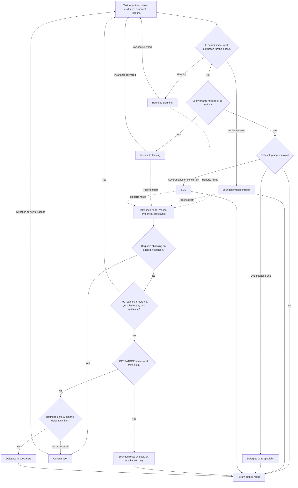

# Workflow selection

Before a planning or implementation phase starts, Takt walks one decision tree and adopts the
route it reaches. Only the adopted route's skill is loaded; no other workflow is loaded to
help decide. The adopted route owns its internal rules, including the signals that show it
does not fit. When one appears, control returns to the tree with that evidence.

## Decision tree

| Step | Question | Answer → outcome |
| --- | --- | --- |
| 1 | Did the user directly and explicitly request direct work for this phase? | Planning without specialists → `takt-bounded-planning`. Implementation without delegation → `takt-bounded-workflow`. No → step 2. |
| 2 | Are required invariants missing or in need of refinement? | Yes → `takt-invariant-planning`; once invariants are delivered, back to step 1 with the updated evidence. No → step 3. |
| 3 | Is development still needed? | Yes, as one bounded unit → delegate it to its specialist within the unplanned-delegation limit. Yes, as several lanes or concurrent implementation → `takt-sdd-workflow`. No → return the settled result. |

An instruction for one phase does not constrain the other. Settled invariants are consumed,
never regenerated. Bounded is never chosen by elimination, convenience, cost, or absence of
specialists. SDD and bounded never govern the same implementation simultaneously.

## Return from an adopted route

| Situation | Outcome |
| --- | --- |
| The adopted route reports, with evidence, that it does not fit | Back to step 1 with the reason, evidence, and constraints; the same route is never re-adopted under identical evidence. |
| The tree leads only to routes that already reported a misfit, and OPERATIONS' three direct-work tests hold | Takt adopts the phase's bounded route by decision, limited to that small action. |
| Same, not trivial, and the work is bounded units within the unplanned-delegation limit | Delegation to the needed specialists; a single planning specialty still goes to its specialist. |
| Uncertainty persists, nothing fits, or proceeding requires changing an explicit user instruction | Takt consults the user with evidence and alternatives and waits for direction. |

## Diagram

The diagram visualizes the tables above; the tables are normative.

